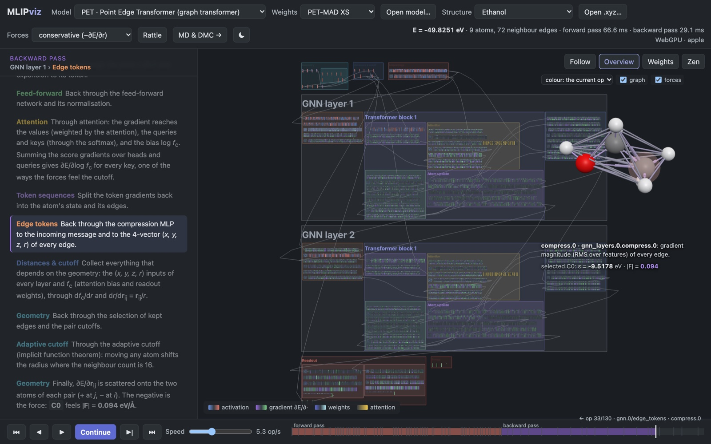
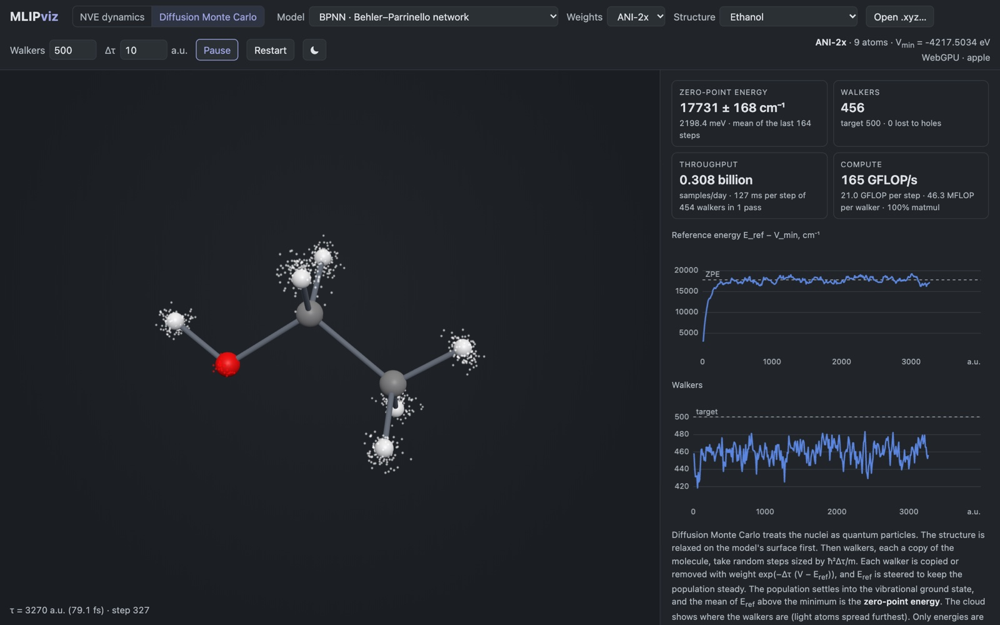
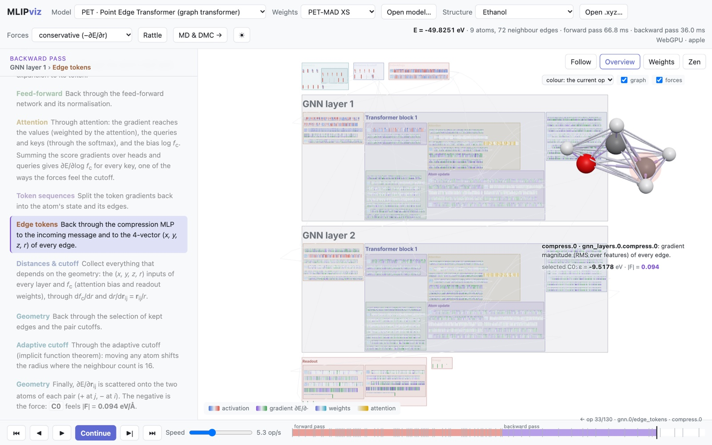

# MLIP-Visualization

Machine-learning interatomic potentials running in the browser, with every forward and backward pass
drawn the way Brendan Bycroft's [LLM Visualization](https://bbycroft.net/llm) draws a transformer.

Try it on [GitHub Pages](https://ericboittier.github.io/MLIP-Visualization/) or as a
[Hugging Face Space](https://huggingface.co/spaces/EricBoi/mlip-visualization). Both serve the same
static build, and everything runs on your machine.



Each op's output is a block of cells holding its actual values. Cells fill in as the forward pass
reaches them and switch to gradient colours as the backward pass, which gives the forces, comes back.
Next to the network, the structure view shows the atoms, the graph the model uses and the forces,
coloured by the current op or by atomic energy, |F|, charge or attention.

The models run in a Web Worker on a small tape-based autograd engine written in TypeScript, with a CPU
backend and a WebGPU backend (WGSL kernels for every op, forward and backward).

| model | family | status |
|---|---|---|
| PET (PET-MAD, PET-MOLS) | point edge transformer | verified against metatrain |
| ANI-2x | Behler–Parrinello network | verified against TorchANI |
| KRR with SOAP | kernel method, fitted in the browser to another model | forces checked by finite differences |
| PhysNet (mmml physnetjax, invariant) | message passing with charges and electrostatics | verified against the JAX code; demo model trained on acetone dimers |
| MACE (MACE-MP-0) | equivariant message passing (ACE) | verified against mace-torch |
| LOREM | equivariant message passing with a long-range Coulomb head | verified against metatrain's experimental port; the checkpoint is an untrained random initialization |

SpookyNet is not done yet.

## Dynamics and diffusion Monte Carlo



`md.html`, linked as "MD & DMC" in the header, runs simulations with PET, MACE or ANI-2x. PhysNet and
LOREM are left out because their weights are demos, and KRR because it is fitted to a single structure.

NVE mode runs velocity Verlet from Maxwell–Boltzmann velocities and plots the energies and the
temperature. Models with a direct force head can drive the dynamics with those forces instead. They are
not the gradient of an energy, so the total energy drifts.

DMC mode estimates the zero-point energy of an isolated molecule. The structure is relaxed with FIRE
first, then an unguided population of walkers is propagated with discrete branching. The estimate is
the mean of E_ref − V_min over the second half of the run, with a blocking error. DMC only needs
energies, so the walkers go through the model together: copies of the molecule are placed further apart
than the cutoff, and each copy's energy is the sum of its atomic energies. A pass holds up to 4096 atoms
for PET and ANI-2x and 512 for MACE, and is halved if the GPU refuses a buffer (`?maxAtoms=` overrides
this). Walkers that fall far below the minimum have found a hole in the model and are removed.

Both modes count FLOPs per step from the shapes of the kernels each model runs (`src/engine/flops.ts`,
a multiply-add is 2), and report the rate, ns/day for MD and samples per day for DMC.
`?mode=dmc&model=<name>&structure=<preset>` sets the starting point.

## Light and dark

The app follows the system setting; the button in the header switches between system, light and dark.
The colours come from [Metatensor](https://docs.metatensor.org) and metatomic.



## Running locally

```bash
npm install
npm run dev
```

Model weights are not in the repository. Convert them into `public/models/`:

```bash
uv run scripts/convert_pet.py --model pet-mad-xs --out public/models/pet-mad-xs   # add --non-conservative for direct forces
uv run scripts/convert_ani.py --out public/models/ani-2x
uv run scripts/convert_mace.py --model mace-mp-0b3-medium --out public/models/mace-mp-0b3-medium
# LOREM needs the metatrain checkout's lorem-tests env (the experimental port is not on PyPI):
#   <metatrain>/.tox/lorem-tests/bin/python scripts/convert_lorem.py --out public/models/lorem-demo
uv run scripts/convert_mace.py --model mace-mp-0b2-small --out public/models/mace-mp-0b2-small
```

PhysNet models come from mmml's `physnetjax` (invariant, `max_degree = 0`):

```bash
~/mmml-asv/.venv/bin/python scripts/train_physnet_demo.py --data ~/mmml-asv/examples/fixed-acetone-only_MP2_21000.npz --out acetone.params.json
uv run scripts/export_physnet.py --params acetone.params.json --out public/models/physnet-acetone --elements 1,6,8
```

KRR/SOAP needs no files. It is fitted in the browser on rattled copies of the current structure,
labelled by another model (the teacher), which has to be one with production weights: PET, MACE or
ANI-2x.

`public/models/index.json` lists the models the app offers. If `public/models/` has no weights, as in a
deployed build, the app downloads them from
[EricBoi/mlip-visualization-models](https://huggingface.co/EricBoi/mlip-visualization-models) on
Hugging Face. `?models=<base url>` points it at another folder with an `index.json`. To upload the
local models there, with a model card listing each one's source and licence (log in with
`hf auth login` first):

```bash
uv run scripts/publish_weights.py --dry-run   # lists the files
uv run scripts/publish_weights.py
```

## Deployment

`npm run build` writes a static site to `dist/`. On every push to `main`,
`.github/workflows/deploy.yml` builds it and publishes it to
[GitHub Pages](https://ericboittier.github.io/MLIP-Visualization/) and to the
[Hugging Face Space](https://huggingface.co/spaces/EricBoi/mlip-visualization). The Space step needs an
`HF_TOKEN` repository secret with write access and skips itself without one;
`uv run scripts/deploy_space.py` does the same from your machine after a build. Neither deployment
includes the weights, which come from the model repository above.

## Tests

```bash
npm test
```

They compare energies, forces and stresses with reference values from the
original implementations (`scripts/make_reference.py`), and the WebGPU kernels
with the CPU ones (through Node's `webgpu` package).

## Credits

MACE-MP-0 is from [mace-foundations/mace-mp-0](https://huggingface.co/mace-foundations/mace-mp-0) (MIT).
LOREM follows [metatrain's experimental port](https://github.com/lab-cosmo/metatrain) of Bigi et al., arXiv:2507.19382;
the demo checkpoint is an untrained draw of that architecture.
ANI-2x is from [TorchANI](https://github.com/aiqm/torchani) (MIT).
`scripts/convert_pet.py` comes from
[pet-kokkos](https://github.com/EricBoittier/pet-kokkos). PET and PET-MAD are
from the [lab-cosmo/upet](https://huggingface.co/lab-cosmo/upet) models
(BSD-3-Clause).
